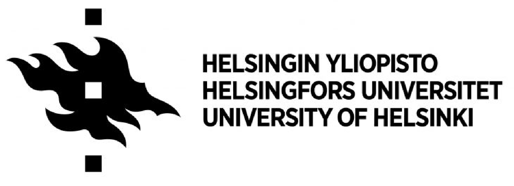

---
---

# Our mission

To unravel how lipid flux shapes cellular architecture in health and disease. We do this via advanced cell and in-cell structural biology at nanoscale resolution.



## Highlights


We study how organelles form, remodel, and coordinate metabolic decisions, using cryo-CLEM, cryo-ET, and live-cell imaging approaches.







Our work spans in-cell structural biology, membrane architecture, and nanoscale regulation of lipid flux in health and disease.







The Salo Lab launches in 2026 at Karolinska Institutet and the University of Helsinki. We are currently recruiting—come build the lab with us.








## Latest from the blog


We gratefully acknowledge all past and present funding agencies and institutional partners who support our research and scientific environment.

  

  

  

  

  

  

